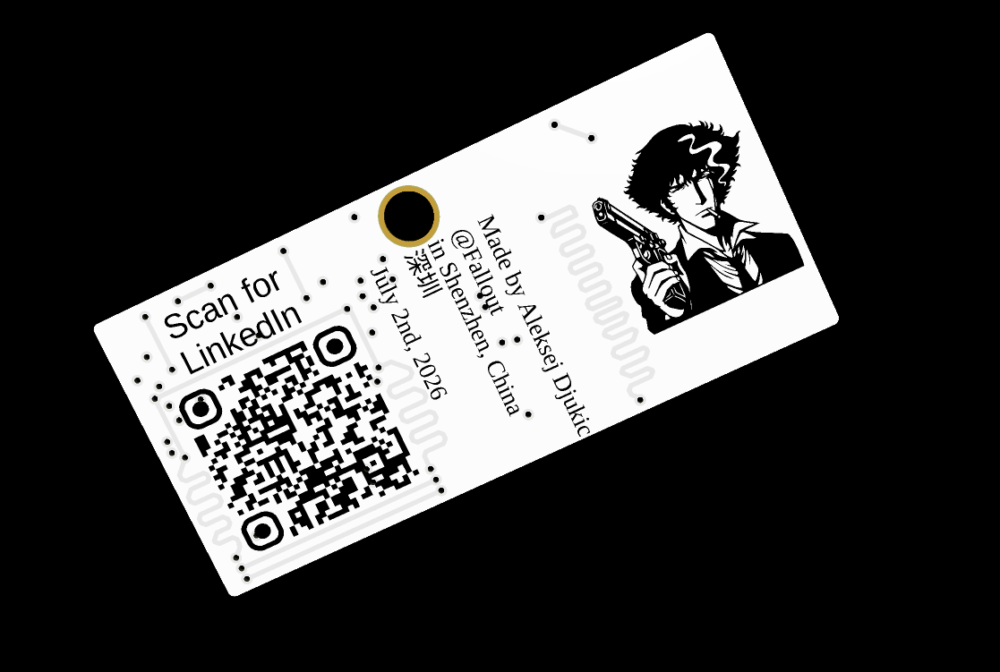
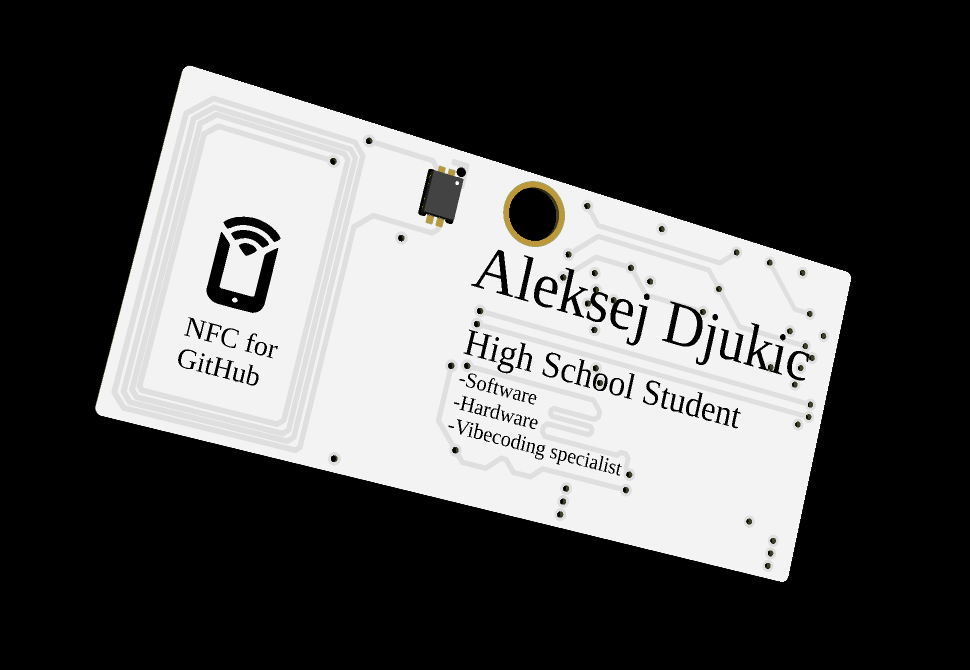

<h1 align="center">PCB Badge — Fallout 2026</h1>

<p align="center">
  A custom PCB business card / badge made for <b>Fallout 2026</b> in Shenzhen, China.
</p>

<p align="center">
  
</p>

---

## About

This project is a custom PCB badge designed as a futuristic business card.  
It combines PCB art, personal branding, NFC, and QR functionality into one physical badge.

The badge includes:

- My name and personal title
- A QR code linking to my LinkedIn
- NFC functionality linking to my GitHub
- Decorative PCB traces and vias
- Cyberpunk / hacker-style visual design
- Front and back silkscreen artwork
- Gerber files ready for PCB manufacturing

This badge was made as a personal hardware project for **Fallout 2026**.

---

## Preview

### Front Side

<p align="center">
  
</p>

The front side contains the NFC area, my name, and the main business-card style layout.

### Back Side

<p align="center">
  
</p>

The back side contains the LinkedIn QR code, location/date text, and additional PCB art.

---

## Features

| Feature | Description |
|---|---|
| NFC Tag | Opens my GitHub profile when scanned |
| QR Code | Opens my LinkedIn profile |
| PCB Business Card | Designed as a physical networking badge |
| Custom Artwork | Includes stylized silkscreen graphics and traces |
| Gerber Files | Ready for PCB fabrication |
| Fallout 2026 Theme | Made for the Shenzhen hardware event |

---

## Repository Contents

```txt
PCB-Badge_Fallout2026/
├── Pcb-front.png              # Render of the front side
├── PCB-Back.png               # Render of the back side
├── PCB-Badge_Gerbers.zip      # Gerber files for manufacturing
├── LICENSE                    # MIT License
└── README.md                  # Project documentation
